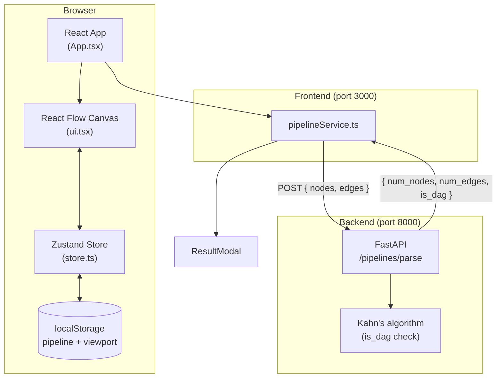
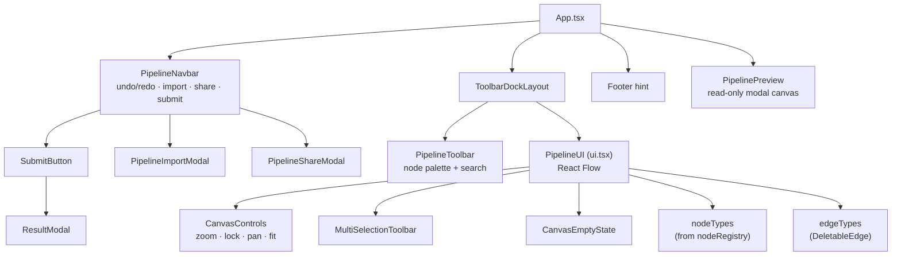
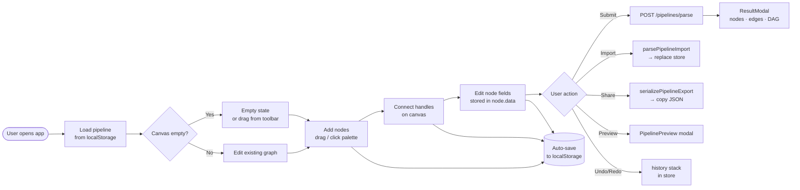
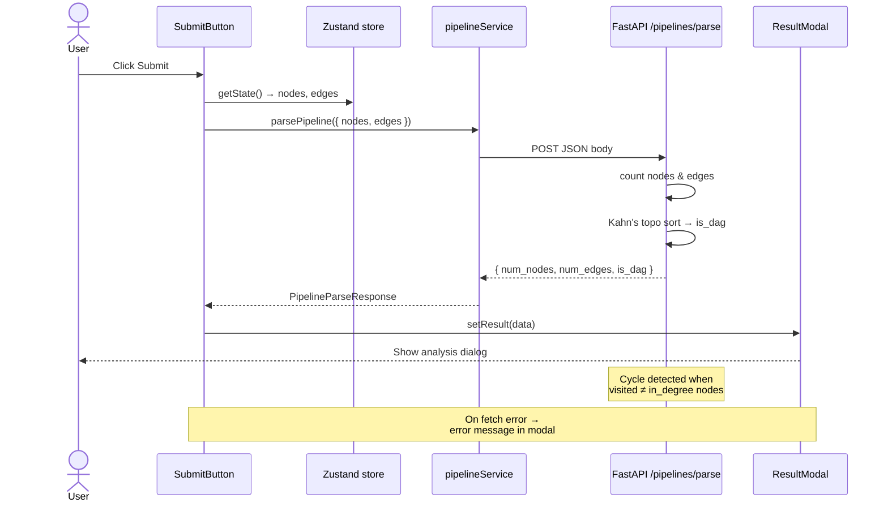
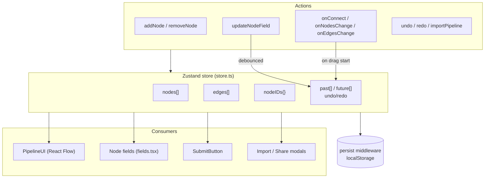
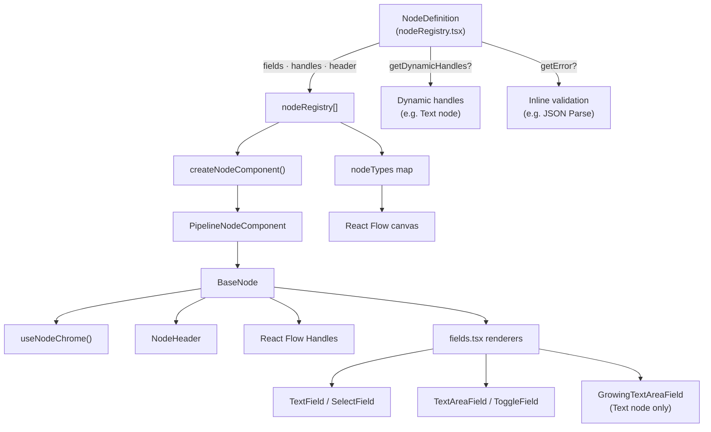
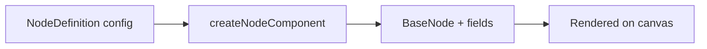
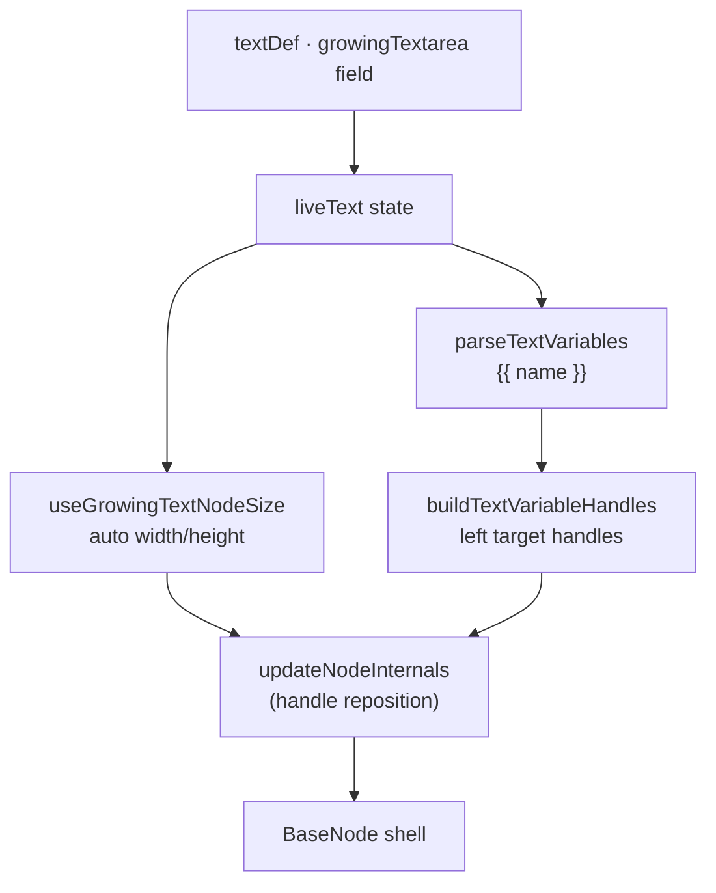
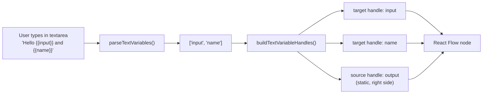

# VectorFlow — Pipeline Builder (Frontend)

React + TypeScript visual pipeline editor built for the VectorShift frontend assessment. Drag nodes onto a canvas, connect handles, and submit the graph to a FastAPI backend for node/edge counts and DAG validation.

## Reviewer quick-start (~60 seconds)

**1. Start the stack**

```bash
# Terminal 1 — backend (repo root)
cd backend && pip install -r requirements.txt && uvicorn main:app --reload

# Terminal 2 — frontend
cd frontend && npm install && npm start
```

Open [http://localhost:3000](http://localhost:3000). Submit needs the API at [http://127.0.0.1:8000](http://127.0.0.1:8000).

**2. Build a minimal pipeline**

1. From the node palette, drag **Input** → **Text** → **Output** onto the canvas (or use **Add Your First Node** on an empty canvas).
2. On the **Text** node, note the default `{{input}}` — a **left target handle** appears for each variable.
3. Connect: **Input → Text** (`input` handle) → **Text output → Output**.
4. Click **Submit** in the navbar — the modal shows node count, edge count, and **DAG status**.

**3. Features worth a quick look**

| Area | Where | What to try |
|------|--------|-------------|
| **Part 3 — dynamic handles** | Text node | Type `Hello {{name}}` — a new left handle appears for `name` |
| **Undo / redo** | Navbar | `Ctrl+Z` / `Ctrl+Shift+Z` (or toolbar icons) |
| **Import / export** | Navbar **Import** · **Share** | Round-trip pipeline JSON |
| **Preview** | Navbar **Preview** | Read-only canvas modal |
| **Node abstraction** | Any custom node | Same chrome (duplicate, collapse, delete); see [EXTENDING_NODES.md](docs/EXTENDING_NODES.md) |

**Optional:** toggle **dark mode** (navbar) · press **`?`** for keyboard shortcuts · dock the palette to another edge via the toolbar controls.

**Assessment mapping:** Part 1 (node factory + 5 custom nodes) · Part 2 (styling) · Part 3 (text resize + `{{var}}` handles) · Part 4 (Submit → `/pipelines/parse`). Details in [Assessment coverage](#assessment-coverage) below.

---

## Setup

### Frontend

```bash
cd frontend
npm install
npm start
```

App runs at [http://localhost:3000](http://localhost:3000).

Optional env:

```bash
# defaults to http://127.0.0.1:8000
REACT_APP_API_URL=http://127.0.0.1:8000
```

### Backend (required for Submit)

From the repo root:

```bash
cd backend
pip install -r requirements.txt
uvicorn main:app --reload
```

API runs at [http://127.0.0.1:8000](http://127.0.0.1:8000).

### Scripts

| Command | Description |
|---------|-------------|
| `npm start` | Dev server |
| `npm run build` | Production build |
| `npm test` | Jest (watch mode) |
| `npm run test:ci` | Jest (single run, CI) |
| `npm run typecheck` | TypeScript check (`tsc --noEmit`) |

Tests live in `/test` with a custom `jest.config.js` because Create React App only discovers tests under `/src` by default.

### Desktop-first layout

The editor is optimized for **desktop** (≥900px): full navbar actions, dockable node palette, and canvas shortcuts. On narrower viewports:

- **Import / Share / Preview** move into the **⋮ overflow menu** in the navbar (Submit stays visible).
- The node palette remains usable via the dock toolbar; complex graph editing on phones is supported but not the primary target.

If you are reviewing on mobile, use the overflow menu for pipeline actions and landscape orientation for the canvas when possible.

---

## Architecture

### System overview

How the frontend, backend, and browser storage fit together.



### UI component tree

Layout of the main shell and where each feature lives.



### User interaction flow

End-to-end path from opening the app to analyzing a pipeline.



### Submit & backend flow

Sequence for Part 4 of the assessment.



### State management

What lives in Zustand and how changes propagate.



### Node abstraction

How a new node type is declared and rendered — Part 1 core pattern.



**Standard node (e.g. LLM, Condition):**



**Text node (Part 3 extensions):**



### Text node: variable handles

Detail for Part 3 — typing `{{input}}` creates input handles.



---

## Extending the abstraction

Full step-by-step guide: **[docs/EXTENDING_NODES.md](docs/EXTENDING_NODES.md)**

### At a glance

| Goal | What to change | Example in repo |
|------|----------------|-----------------|
| New node type | Add `NodeDefinition` to `nodeRegistry.tsx` | Condition, Merge, Note |
| New field type | `types/nodes.ts` → `fields.tsx` → `renderField` switch | **`number`** field (`NumberField`) |
| Dynamic handles | `getDynamicHandles` on definition | Text node `{{var}}` inputs |
| Validation banner | `getError` on definition | JSON Parse node |
| Node-level layout | Hooks in `createNodeComponent` | Text auto-resize |

### Field kinds (6 total)

| Kind | Purpose |
|------|---------|
| `text` / `select` / `textarea` / `toggle` | Standard inputs |
| `growingTextarea` | Auto-resize + variable handles (advanced factory logic) |
| `number` | **Custom extension demo** — used on HTTP Request (`timeoutMs`) |

Adding a node is usually **config only**. Adding a field is **3 files** (types, component, factory switch). See the doc for copy-paste templates and checklists.

---

## Folder structure

```
src/
├── App.tsx                 # Shell: navbar, dockable toolbar, canvas, preview
├── ui.tsx                  # React Flow canvas (nodes, edges, controls)
├── store.ts                # Zustand pipeline state + undo/redo + persistence
├── submit.tsx              # Submit button → backend parse endpoint
├── nodes/
│   ├── nodeRegistry.tsx    # Declarative node definitions (9 types)
│   ├── createNode.tsx      # NodeDefinition → React component factory
│   ├── BaseNode.tsx        # Shared node shell (handles, body, collapse)
│   ├── NodeHeader.tsx      # Toolbar actions (duplicate, collapse, delete)
│   └── fields.tsx          # Field components (text, select, number, …)
├── docs/
│   └── EXTENDING_NODES.md  # How to add nodes & custom field types
├── hooks/
│   ├── useNodeChrome.ts    # Shared header/toolbar behavior
│   └── useGrowingTextNodeSize.ts
├── utils/
│   ├── textVariables.ts    # {{variable}} parsing + dynamic handles
│   └── pipelineImportExport.ts
├── services/pipelineService.ts
└── components/             # Navbar, modals, canvas controls, Icon wrapper
test/                         # Unit & component tests
```

### Key patterns

- **Node abstraction** — add a `NodeDefinition` in `nodeRegistry.tsx`; see [docs/EXTENDING_NODES.md](docs/EXTENDING_NODES.md).
- **Custom fields** — extend the `FieldConfig` union + `fields.tsx` + `renderField`; `number` is the worked example.
- **Shared chrome** — `useNodeChrome` + `NodeHeader` centralize duplicate/delete/collapse and canvas focus.
- **Icons** — `<Icon icon={FiX} />` wraps react-icons with one internal type cast.

---

## Tradeoffs

| Choice | Why | Cost |
|--------|-----|------|
| **Config-driven nodes** | Fast to add nodes; styles stay consistent | Text node needs extra hooks (`growingTextarea`, dynamic handles) beyond plain fields |
| **Zustand + persist** | Simple global state, survives refresh | Large pipelines increase localStorage payload |
| **Modal vs `alert` for submit** | Better UX for errors and DAG status | Slightly deviates from bare assessment spec |
| **Extra features** (undo/redo, import/export, preview, dock toolbar) | Demonstrates product thinking | More surface area than a minimal take-home |
| **CRA + custom Jest config** | No eject; tests in `/test` folder | Two test setups (`react-scripts` vs `jest.config.js`) |
| **CSS modules avoided** | Shared theme tokens in `styles/theme.css` | Global class names (`vs-*`) require naming discipline |
| **Backend DAG check on edges only** | Matches provided API shape | Isolated nodes with no edges still count as a valid DAG |

---

## Assessment coverage

| Part | Feature | Implementation |
|------|---------|----------------|
| **1** | Node abstraction | `NodeDefinition` → `createNodeComponent` → `BaseNode` |
| **1** | 5 custom nodes | Condition, HTTP Request, Merge, Note, JSON Parse |
| **1** | Custom field type | `number` field on HTTP Request (timeout) |
| **2** | Styling | `styles/theme.css` + component CSS |
| **3** | Text auto-resize | `GrowingTextAreaField` + `useGrowingTextNodeSize` |
| **3** | `{{variable}}` handles | `parseTextVariables` + `getDynamicHandles` |
| **4** | Backend integration | `pipelineService` → `/pipelines/parse` → `ResultModal` |
