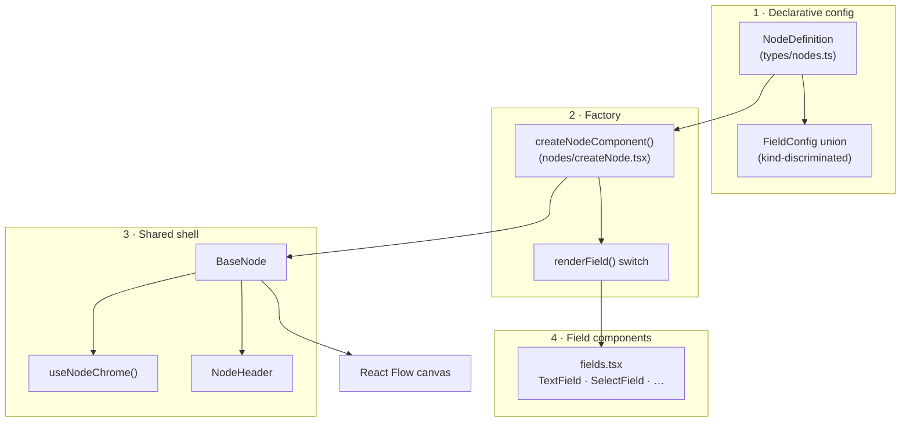
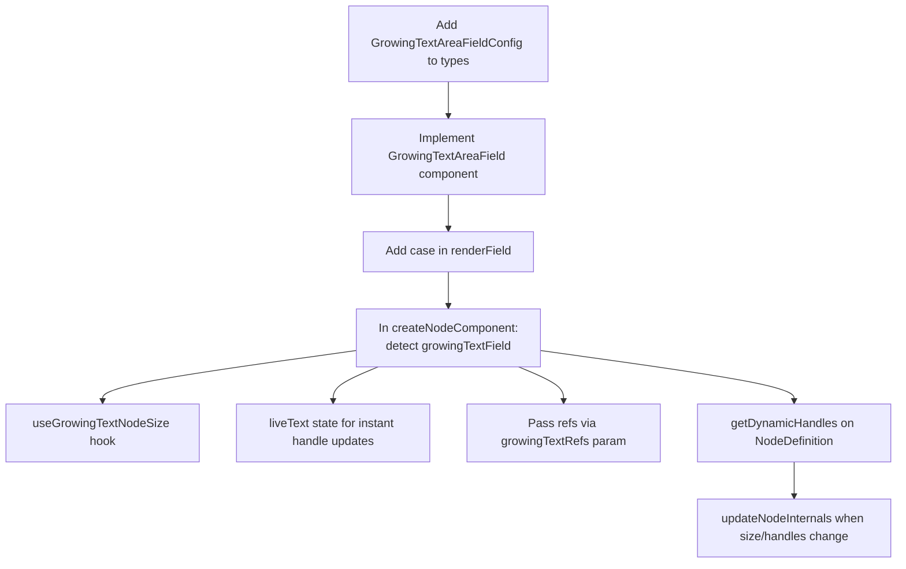
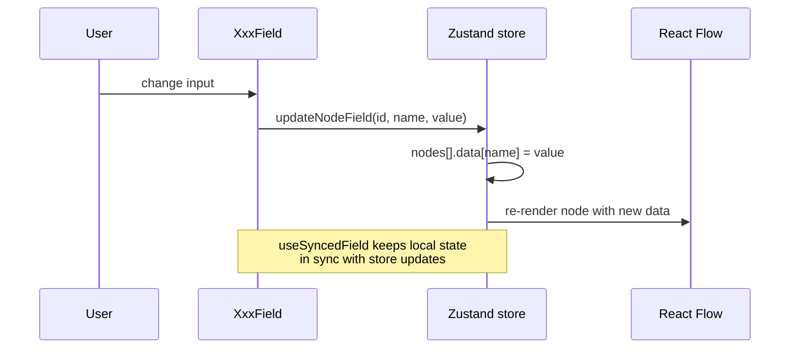

# Extending the Node Abstraction

This guide explains how the pipeline node system is structured and how to extend it — without copying `BaseNode` or duplicating toolbar logic.

## Abstraction layers



| Layer | File(s) | Responsibility |
|-------|---------|----------------|
| **Types** | `types/nodes.ts` | `NodeDefinition`, `FieldConfig`, `HandleConfig` shapes |
| **Registry** | `nodes/nodeRegistry.tsx` | One config object per node type; exports `nodeRegistry` / `nodeTypes` |
| **Factory** | `nodes/createNode.tsx` | Maps config → React component; merges dynamic handles |
| **Shell** | `BaseNode`, `NodeHeader`, `useNodeChrome` | Handles, collapse, duplicate, delete, styling |
| **Fields** | `nodes/fields.tsx` | Input widgets; sync values to `store.updateNodeField` |

**Rule of thumb:** if a node only needs different labels, inputs, and handle positions, add a `NodeDefinition` — no new React component file.

---

## Built-in field kinds

| `kind` | Component | Use case |
|--------|-----------|----------|
| `text` | `TextField` | Single-line string |
| `select` | `SelectField` | Fixed option list |
| `textarea` | `TextAreaField` | Multi-line static height |
| `toggle` | `ToggleField` | Boolean flag |
| `growingTextarea` | `GrowingTextAreaField` | Auto-resize text + variable handles (Text node) |
| `number` | `NumberField` | **Custom example** — numeric input with min/max/step |

---

## Add a new node (config only)

Example: a **Delay** node that waits N milliseconds.

### Step 1 — Define in `nodeRegistry.tsx`

```typescript
const delayDef: NodeDefinition = {
  type: 'delay',
  label: 'Delay',
  category: 'logic',
  header: { title: 'Delay', icon: <Icon icon={FiClock} />, accent: 'orange' },
  fields: [
    {
      kind: 'number',           // reuse existing custom field
      name: 'delayMs',
      label: 'Delay',
      defaultValue: 1000,
      min: 0,
      max: 60000,
      step: 100,
      unit: 'ms',
    },
  ],
  handles: [
    { type: 'target', position: 'left', idSuffix: 'input', color: 'sky' },
    { type: 'source', position: 'right', idSuffix: 'output', color: 'sky' },
  ],
};
```

### Step 2 — Register it

```typescript
const definitions: NodeDefinition[] = [
  // …existing defs
  delayDef,
];
```

That's it. `definitions.map(createNodeComponent)` picks it up automatically; the toolbar reads `nodeRegistry`.

### Optional hooks on `NodeDefinition`

| Property | When to use |
|----------|-------------|
| `staticContent` | Read-only description above fields |
| `getError(data)` | Inline validation (see JSON Parse node) |
| `getDynamicHandles(data)` | Handles derived from field values (see Text node) |
| `className` / `focusFallbackHeight` | Node-specific layout (see Text node) |
| `defaultData` | Extra defaults merged in `getDefaultNodeData` |

---

## Add a new field type

The **`number`** field is the reference implementation for extending beyond the original five field kinds.

### Step 1 — Extend the type union (`types/nodes.ts`)

```typescript
export interface NumberFieldConfig extends BaseFieldConfig {
  kind: 'number';
  defaultValue?: number;
  min?: number;
  max?: number;
  step?: number;
  unit?: string;
}

export type FieldConfig =
  | TextFieldConfig
  // …
  | NumberFieldConfig;
```

### Step 2 — Implement the component (`nodes/fields.tsx`)

All fields use `useSyncedField` so values persist in `node.data` via Zustand:

```typescript
export const NumberField = ({ nodeId, data, name, label, defaultValue = 0, min, max, step, unit }) => {
  const [value, setValue] = useSyncedField(nodeId, name, defaultValue, data);

  return (
    <div className="vs-field">
      <label className="vs-field__label">{label}{unit ? ` (${unit})` : ''}</label>
      <input
        type="number"
        className="vs-field__input"
        value={Number(value)}
        min={min} max={max} step={step}
        onChange={(e) => setValue(Number(e.target.value))}
      />
    </div>
  );
};
```

### Step 3 — Register in the factory (`nodes/createNode.tsx`)

Add a `case` to `renderField`:

```typescript
case 'number':
  return (
    <NumberField
      key={field.name}
      {...base}
      defaultValue={field.defaultValue}
      min={field.min}
      max={field.max}
      step={field.step}
      unit={field.unit}
    />
  );
```

### Step 4 — Use it in any node definition

Already wired on **HTTP Request** → `timeoutMs`:

```typescript
{
  kind: 'number',
  name: 'timeoutMs',
  label: 'Timeout',
  defaultValue: 30000,
  min: 1000,
  max: 120000,
  step: 1000,
  unit: 'ms',
},
```

### Checklist for a new field kind

- [ ] Add `XxxFieldConfig` with unique `kind` literal to `types/nodes.ts`
- [ ] Append to `FieldConfig` union
- [ ] Create `XxxField` in `fields.tsx` using `useSyncedField`
- [ ] Add `case 'xxx':` in `renderField` (`createNode.tsx`)
- [ ] Reference in at least one `NodeDefinition` to prove it works

---

## Advanced: field types that need factory logic

Some fields cannot be a simple switch case — they need **refs, layout effects, or dynamic handles** inside `createNodeComponent`.

**`growingTextarea` (Text node)** is the pattern:



Files involved:

| Concern | Location |
|---------|----------|
| Variable parsing | `utils/textVariables.ts` |
| Handle builder | `buildTextVariableHandles()` |
| Size measurement | `hooks/useGrowingTextNodeSize.ts` |
| Dynamic handles config | `textDef.getDynamicHandles` in `nodeRegistry.tsx` |
| Factory orchestration | `createNode.tsx` (growing text branch) |

Only use this path when the field affects **node dimensions** or **handle topology**. For ordinary inputs, the three-step field extension above is enough.

---

## Advanced: fully custom node component

Avoid if possible. If a node cannot be expressed as `NodeDefinition` + fields:

1. Build a component that composes `BaseNode` + `useNodeChrome` (same as `NodeHeader` does).
2. Register it manually in `nodeRegistry` instead of `createNodeComponent(def)`.

The Text node **used to** be a standalone component; it now uses the factory with `growingTextarea` + `getDynamicHandles` — prefer extending the factory first.

---

## Quick reference: data flow for field edits



Field values live on `node.data[fieldName]` and survive import/export, undo/redo, and localStorage persistence automatically.
